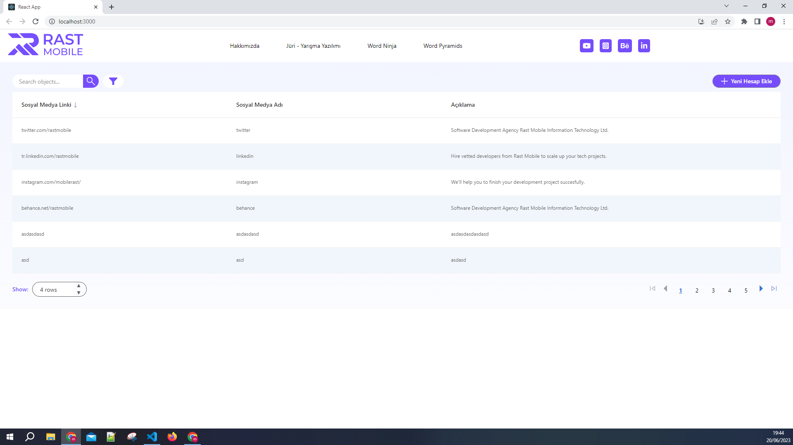
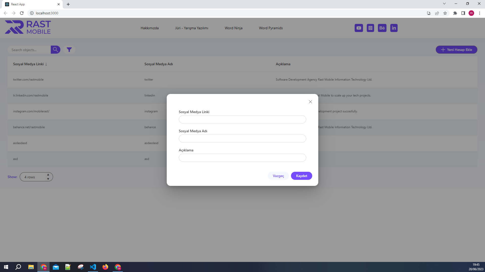

# Getting Started with Create React App

This project was bootstrapped with [Create React App](https://github.com/facebook/create-react-app). This project is a simple DataGrid Template. The data added to the LocalStorage with the "accounts" key via the modal opened with the "Yeni Hesap Ekle" Button. Requests "Post" and "Get" with the [axios-mock-adapter](https://www.npmjs.com/package/axios-mock-adapter) library. 2 seconds delay to response time has been adjusted to make requests look more realistic.

## To Start:

`npm start`

## Technologies and libraries used:

React, Fluent UI, Axios, Axios-Mock-Adapter, Font Awesome Icons.

## Screens:

